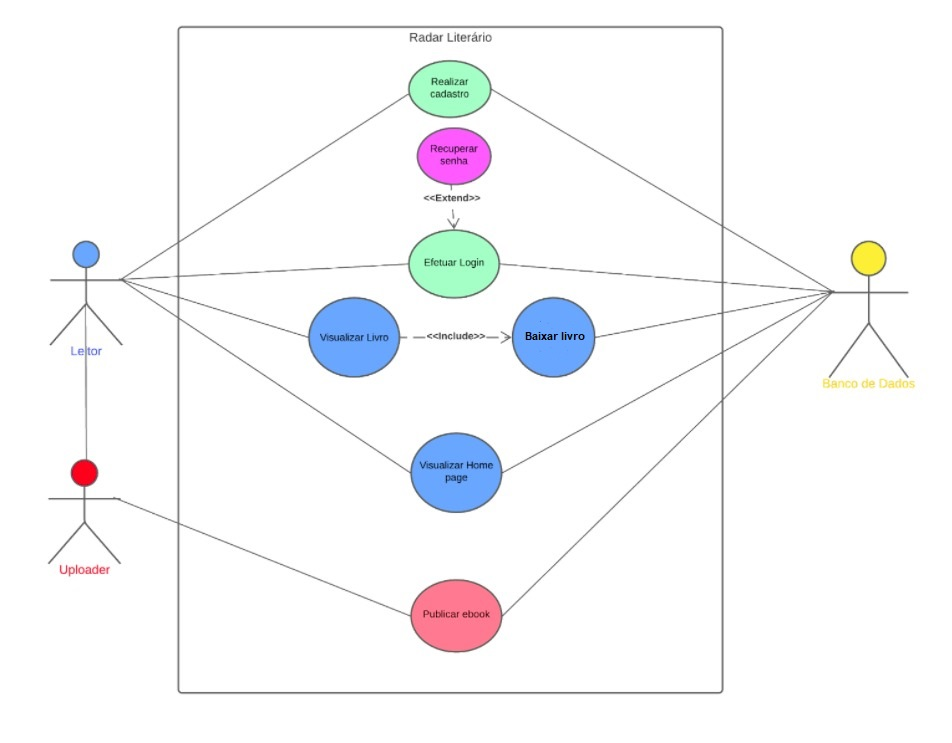

# Especificações do Projeto

A definição exata do problema e os pontos mais relevantes a serem tratados neste projeto foi consolidada em um trabalho de construção feito pelos membros da equipe a partir de situações próprias vividas ou presenciadas em seu cotidiano. Os detalhes levantados nesse processo foram consolidados na forma de personas e histórias de usuários.

## Personas

##### GUILHERME DIAS
**Idade:** 17 Anos.  
**Ocupação:** Estudante.  
**Aplicativos:** TikTok, Twitter, Instagram e YouTube.  
**Motivação:** Guilherme já está pensando no Enem e como pretende estudar. E para seguir carreira na área de tecnologia precisa de uma boa base de estudos para conseguir seus objetivos.  
**Frustrações:** Infelizmente, não tem boas condições financeiras para se matricular em cursinhos, ou adquirir algumas apostilas de estudo.  
**Hobbies:** Gosta de sair com os amigos nos finais de semana, adora jogar video game, animes e mangás.  

##### NATHALIA GOMES 
**Idade:** 38 Anos.  
**Ocupação:** Assistente Administrativa.  
**Aplicativos:** Linkedin, Instagram e Telegram.  
**Motivação:** Nathalia quer complementar seus conhecimentos acadêmicos e se tornar uma profissional mais qualificada e assim ser contratada pela empresa no final do estágio.  
**Frustrações:** Nathalia não tem condição no momento de adquirir materiais de apoio para auxiliar no seu estudo, tendo que procurar conteúdo de graças na internet.  
**Hobbies:** Gosta de ver séries, filmes e sair com os amigos, gosta bastante de ler, seu gênero de livro preferido e ficção.  

##### ISABEL FIGUEIREDO
**Idade:** 23 Anos.  
**Ocupação:** Operadora de Caixa.  
**Aplicativos:** Twitter, Spotify, Instagram e WhatsApp.  
**Motivação:** É uma leitora voraz de escritores brasileiros como Machado de Assis e Clarice Lispector.  
**Frustrações:** Sente que pode compartilhar mais sobre a grandeza da literatura brasileira compartilhando seus ebooks adquiridos anteriormente de forma gratuita e com todos os direitos autorais preservados.  
**Hobbies:** Gosta de contribuir com um programa de incentivo a leitura da escola local, ama sair com amigos e trocar experiências.  

##### ANTÔNIO CALDEIRA
**Idade:** 42 Anos.  
**Ocupação:** Vendedor de Comércio Varejista.  
**Aplicativos:** Facebook, Instagram e WhatsApp.  
**Motivação:** Gosta de ler em seus momentos vagos no trabalho, e da praticidade e comodidade de conseguir fazer isso pela internet, além de compartilhar conteúdo com outras pessoas que compartilham do mesmo gosto.  
**Frustrações:** Falta de disponibilidade em achar alguns livros.  
**Hobbies:** Leitor de obras com conteúdo filosófico e histórico, também um grande fã de futebol.  

##### CECILIA LORENA
**Idade:** 56 Anos.  
**Ocupação:** Dona de Casa.  
**Aplicativos:** Instagram e WhatsApp.  
**Motivação:** Por ser muito devota ao catolicismo, Cecília pediu aos seus sobrinhos que recomendassem um site para adquirir conteúdos sobre esses temas de forma gratuita.  
**Frustrações:** Por achar difícil a locomoção e a falta de segurança e empatia nas ruas com as pessoas mais velhas.  
**Hobbies:** Gosta de ver novelas, séries e programas com conteúdos religiosos, também têm o hábito de ler muito sobre o tema.  

## Histórias de Usuários

Com base na análise das personas foram identificadas as seguintes histórias de usuários:

|EU COMO...          | QUERO/PRECISO ...                  |PARA ...                                     |
|--------------------|------------------------------------|---------------------------------------------|
|Isabel Figueiredo   |Ter um perfil no site               |Salvar informações e configurações           |
|Nathalia Gomes      |Categorizar a pesquisa              |Encontrar ebooks específicos de administração|
|Guilherme Dias      |Fazer busca de livros               |Pesquisar material de apoio para o Enem      |
|Isabel Figueiredo   |Fazer upload de ebooks              |Compartilhar materiais com a comunidade      |
|Antônio Caldeira    |Visualizar sinopse do livro         |Ter informação sobre o material disponível   |
|Cecilia Lorena      |Adicionar livros aos favoritos      |Salvar os melhores materiais                 |
|Antônio Caldeira    |Fazer comentários sobre livros      |Interagir com leitores com mesmo interesse   |

## Requisitos

As tabelas que se seguem apresentam os requisitos funcionais e não funcionais que detalham o escopo do projeto, identificando também a prioridade em que os mesmos devem ser entregues.

### Requisitos Funcionais

|ID    | Descrição do Requisito  | Prioridade |
|------|-----------------------------------------|----|
|RF-001| A aplicação deve permitir o cadastro de novos usuários por meio de um formulário contendo: nome completo, email,   senha e data de nascimento.       | ALTA | 
|RF-002| A aplicação deve permitir que o usuário faça login com as suas credenciais cadastradas e mante-lós no banco de dados.   | ALTA |
|RF-003| A aplicação deve conter a opção de upload de livros com campos pré-definidos de publicação e de preenchimento obrigatório, como capa, autor, categoria, sinopse e faixa etária.  | ALTA |
|RF-004| A aplicação deve permitir a visualização de livros disponíveis com os dados obrigatórios do cadastro.   | ALTA |
|RF-005| A aplicação deve permitir o download dos livros.   | ALTA |
|RF-006| A aplicação deve ter um campo para busca de livros.   | MÉDIA |
|RF-007| A aplicação deve permitir ao usuário editar o perfil (adicionar foto, alterar email, adicionar telefone…).   | MÉDIA |
|RF-008| A aplicação deve permitir ao usuário avaliar os livros que estão publicados.   | BAIXA |
|RF-009| A aplicação deve permitir que o usuario recupere sua senha.   | ALTA |

### Requisitos não Funcionais

|ID     | Descrição do Requisito  |Prioridade |
|-------|-------------------------|----|
|RNF-001| A aplicação deverá ser compatível com os principais navegadores do mercado (Google Chrome, Firefox, Microsoft Edge). | ALTA | 
|RNF-002| Deve ser publicado em um ambiente acessível publicamente na internet (GitHub). |  ALTA | 
|RNF-003| A aplicação deve ser responsiva, se adequando ao dispositivo utilizado pelo usuário. | ALTA | 
|RNF-004|A aplicação deve processar requisições do usuário em no máximo 3s. |  MÉDIA | 
|RNF-006| A aplicação deve ser intuitiva, dispensando a necessidade de treinamento. |  MÉDIA |
|RNF-005| A aplicação deve possuir uma interface limpa e com bom contraste. | MÉDIA |

## Restrições

O projeto está restrito pelos itens apresentados na tabela a seguir.

|ID| Restrição                                             |
|--|-------------------------------------------------------|
|01| O projeto deverá ser entregue até o final do semestre, não podendo extrapolar a data de 26/06/2022.  |
|02| A aplicação deve se restringir às tecnologias básicas de Web no front-end        |
|03| Os livros só podem ser publicados se possuírem direitos autorais que permitam seu compartilhamento.  |
|04|Os livros devem conter em suas informações a faixa etária.        |
|05|O usuário só poderá efetuar o download e/ou upload de um livro se tiver feito login no site.        |

## Diagrama de Casos de Uso

