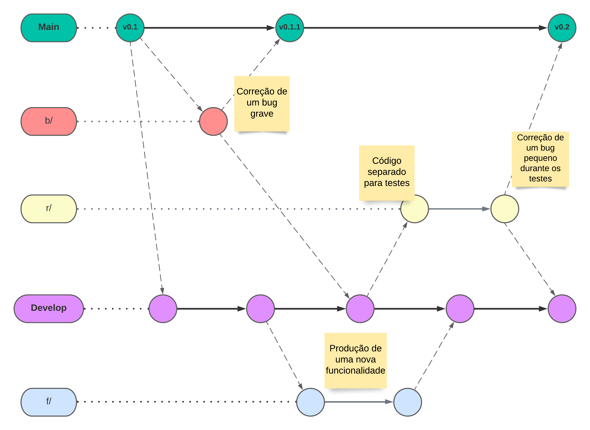
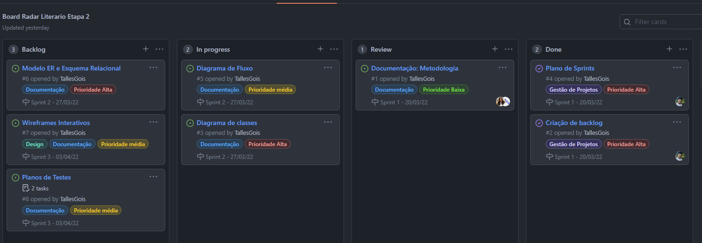

# Metodologia

Pré-requisitos: <a href="2-Especificação do Projeto.md"> Documentação de Especificação</a>

A metodologia contempla as definições de ferramental utilizado pela equipe tanto para a manutenção dos códigos e demais artefatos quanto para a organização do time na execução das tarefas do projeto.

## Relação de Ambientes de Trabalho

Os artefatos do projeto são desenvolvidos a partir de diversas plataformas e a relação dos ambientes com seu respectivo propósito é apresentada na tabela que se segue

Ambiente|Plataforma|Link de Acesso
|:--------|:----------:|:--------------:|
|Repositório|GitHub|  [GitHub](https://github.com/ICEI-PUC-Minas-PMV-ADS/pmv-ads-2022-1-e2-proj-int-t1-radar-literario)|
|Documentos do Projeto|GitHub (docs/)|[Projeto Radar Literario](https://github.com/ICEI-PUC-Minas-PMV-ADS/pmv-ads-2022-1-e2-proj-int-t1-radar-literario/blob/main/README.md)|
|Criação de Diagramas| Diagrams.net | [Diagrams.net](https://www.diagrams.net/)|
|Projeto de Interface e  Wireframes| Figma | [Figma](https://bit.ly/RadarLiterario)|
|Gerenciamento do Projeto|GitHub (Projects)|[GitHub (Projects)](https://github.com/ICEI-PUC-Minas-PMV-ADS/pmv-ads-2022-1-e2-proj-int-t1-radar-literario/projects/1)|

## Controle de Versão

A ferramenta de controle de versão adotada no projeto foi o
[Git](https://git-scm.com/), sendo que o [Github](https://github.com)
foi utilizado para hospedagem do repositório.

O projeto segue a seguinte convenção para o nome de branches:

**Principais**
- *main*: versão estável já testada do software
- *develop*: desenvolvimento da aplicação 

**Branches de suporte (serão removidas assim que não forem mais necessárias)**

`letra-da-branch/prefixo-do-card`

- *f/*: novas funcionalidades
- *b/*: correção de bug
- *r/*: revisões

Quanto à gerência de issues, o projeto adota a seguinte convenção para etiquetas:
documentation: melhorias ou acréscimos à documentação
- *bug*: uma funcionalidade encontra-se com problemas
- *design*: definições de UI e template da aplicação
- *melhoria*: uma funcionalidade precisa ser melhorada
- *implementação*: uma nova funcionalidade precisa ser introduzida

## Gerenciamento de Projeto

### Divisão de Papéis

A equipe utiliza metodologias ágeis, tendo escolhido o Scrum como base para definição do processo de desenvolvimento.  
Sendo assim, o time está organizado da seguinte maneira:  

* _Scrum Master_: Hestefani Romão Durães
* _Product Owner_: Álvaro Alfaya Fonseca
* Equipe de Desenvolvimento
  - Talles Monteiro Góis
  - Mychel Costa da Silva
  -	Alex Junio Gomes De Freitas
  -	Denio Gonçalves de Lima

### Processo

Para organização e distribuição das tarefas do projeto, a equipe está utilizando a ferramenta de gestão do Github estruturado da seguinte forma:

* **Backlog**: esta lista representa o Sprint Backlog. Este é o Sprint atual que estamos trabalhando;
* **In Progress**: representa as tarefas que estão em execução naquele momento;
* **Review**: momento em que todos os integrantes deverão revisar o trabalho do outro para garantir qualidade na entrega;
* **Done**: nesta lista são colocadas as tarefas que passaram pelos testes e controle de qualidade e estão prontos para ser entregues ao usuário. Não há mais edições ou revisões necessárias, ele está agendado e pronto para a ação.

Foi escolhido o quadro de kanban para o gerenciamento do projeto, com o sistema kanban é possível avaliar o progresso do trabalho da equipe, avaliar etapas posteriores, medir o tempo gasto em tarefas especificas e também promover a cooperação entre a equipe, tudo isso utilizando um sistema simples e visual. (AGUIAR, 2007).

A tarefas são classificadas em função da natureza ou prioridade da atividade e seguem o um esquema de etiquetagem entre cores e categorias:

### Ferramentas

As ferramentas empregadas no projeto são:

- Editor de código: Visual Studio 2019
- Ferramentas de comunicação: Microsoft Teams
- Ferramentas para criação de diagramas: Diagrams.net
- Ferramentas de desenho de tela (_wireframing_): Figma

O editor de código foi escolhido porque ele possui uma integração com o sistema de versão e permite depuração na máquina local. 
A ferramenta de comunicação utilizada foi recomendada pela universidade e é bem completa para gestão de equipes e viabiliza chamadas de áudio, vídeo e conversa por chat. 
Para criar diagramas optamos pelo Diagrams.net recomendado pela professora, porque ele integrou-se melhor às nossas necessidades para a solução de problemas. 
Por fim, a ferramenta escolhida para o desenvolvimento dos wireframes e interface de usuário foi escolhida por permitir a edição colaborativa, além de ter funcionalidades voltadas especificamente para a natureza deste trabalho.