# Template Padrão da Aplicação

Pré-requisitos: <a href="2-Especificação do Projeto.md"> Especificação do Projeto</a>, <a href="3-Projeto de Interface.md"> Projeto de Interface</a>, <a href="4-Metodologia.md"> Metodologia</a>

Layout padrão da aplicação que será utilizado em todas as páginas com a definição de identidade visual, aspectos de responsividade e iconografia.

### Tabela de Cores

Antes de definir o template da aplicação, foi necessário definir uma guia de estilos com todos os padrões de cores e ícones que serão utilizados durante o desenvolvimento do projeto. A paleta de cores definida conta com 3 cores primárias, sendo a principal delas definida como cor base, variando entre uma tonalidade diferente e também 3 cores secundárias, conforme a figura abaixo:

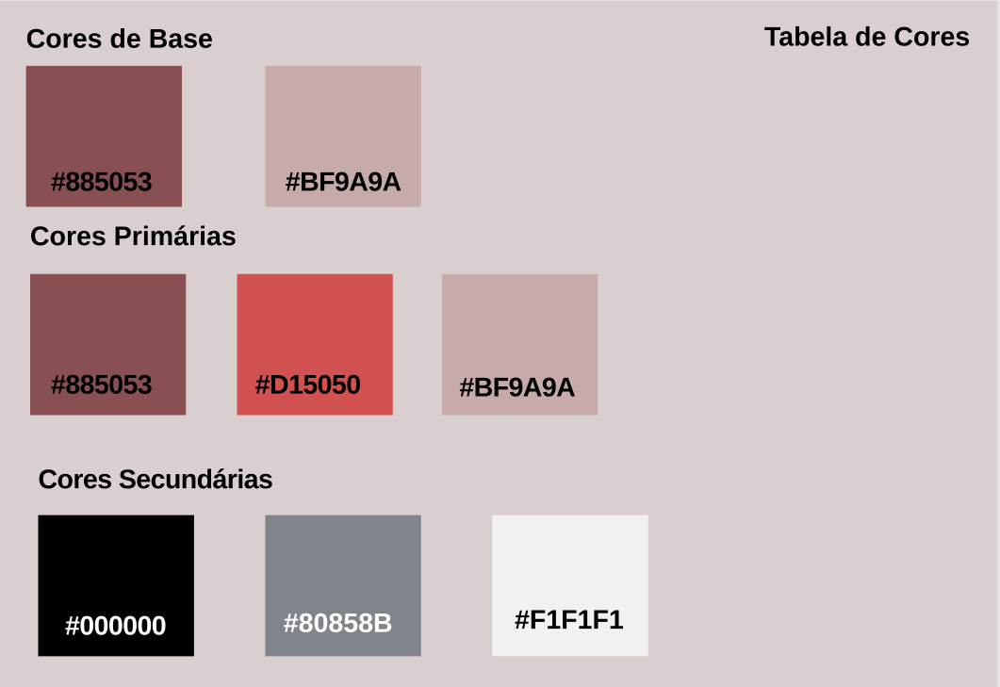

Figura – Paleta de Cores

### Tipografia

As fontes utilizadas na aplicação são Arimo e Baskervville, e seguem as seguintes definições de tamanho e estilização, como pode ser observado na figura abaixo:

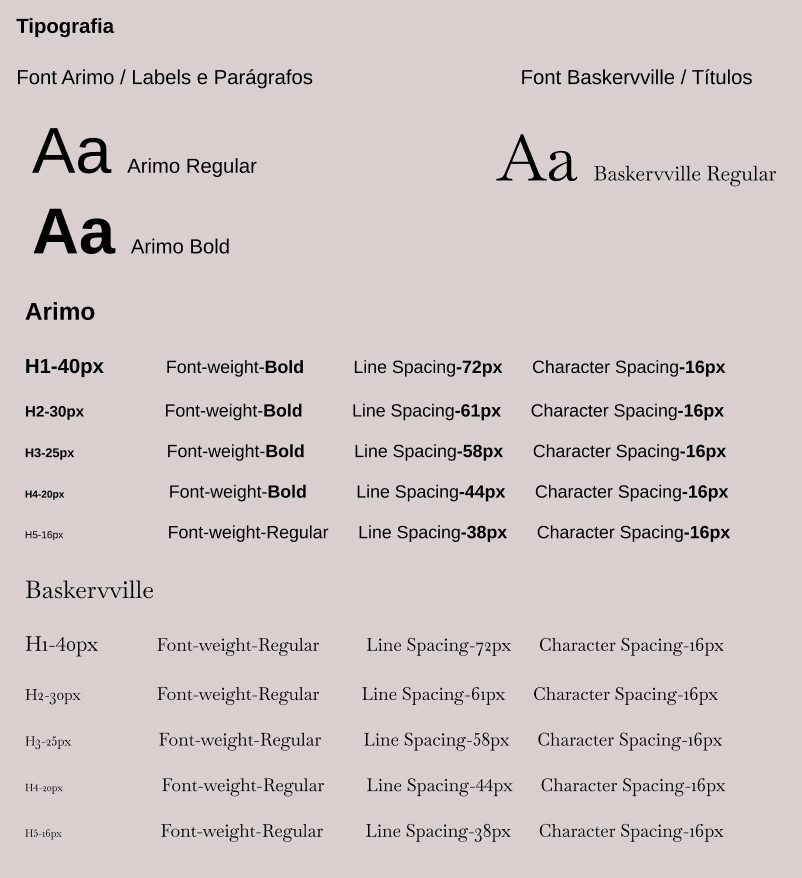

Figura - Tipografia

### Componentes

Nossos principais componentes personalizados são os botões e inputs, conforme pode ser visto na figura abaixo:

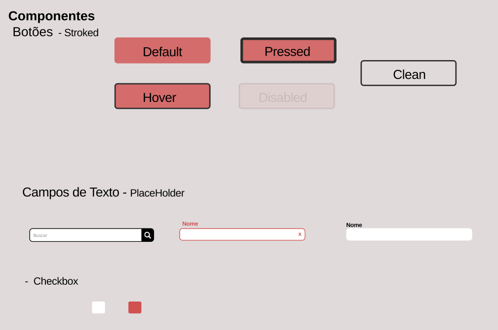

Figura - Componentes

### Ícones 

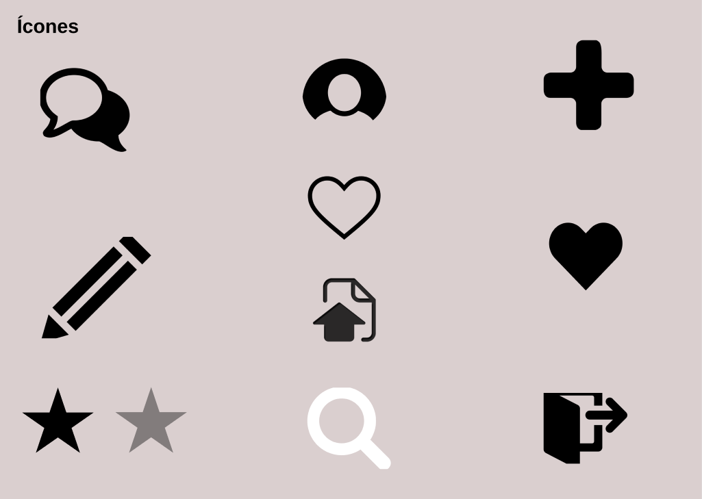

Figura - Ícones

### Homepage

A homepage, é a tela inicial do site para todos os usuários. Com base na estrutura padrão, o bloco de conteúdo apresenta a proposta e o conteúdo encontrado na imagem abaixo.  

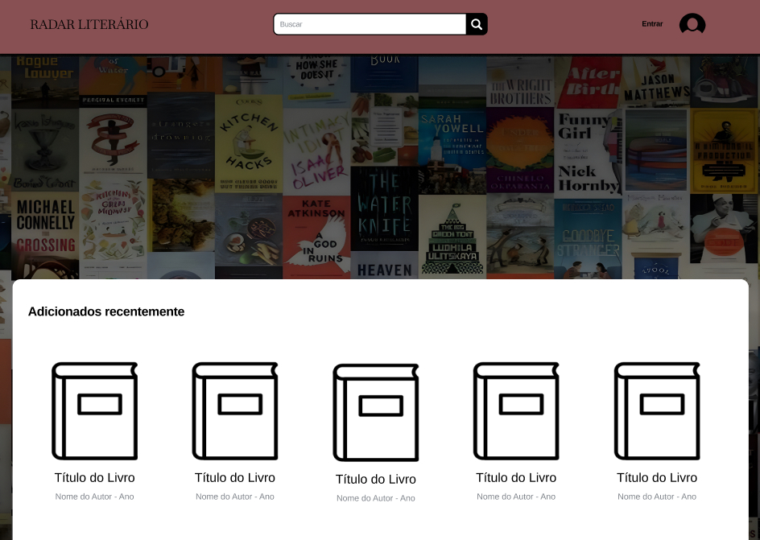

Figura - Homepage

Caso o novo usuário clicar na opção "Entrar" no canto superior direito do cabeçalho ou tentar visualizar um livro, será levado para a [tela de Login](#login) mas ainda poderá visualizar o [resultado de buscas](#tela-de-busca) feitas pela barra de pesquisa. Para ter acesso a todas as funções o usuário precisa se cadastrar e estar conectado em sua conta.

### Login

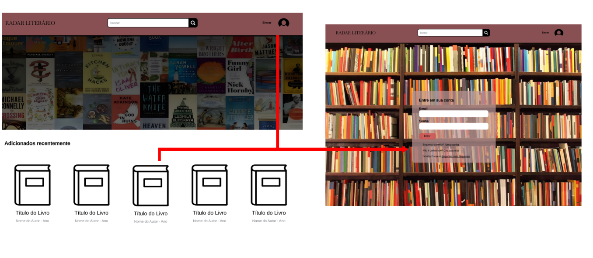

A tela de Login é acessado pelo usuário ao clicar em "Entrar" no canto superior direito do cabeçalho ou tentar acessar alguma função restrita sem estar conectado em sua conta e é apresentada da seguinte forma:

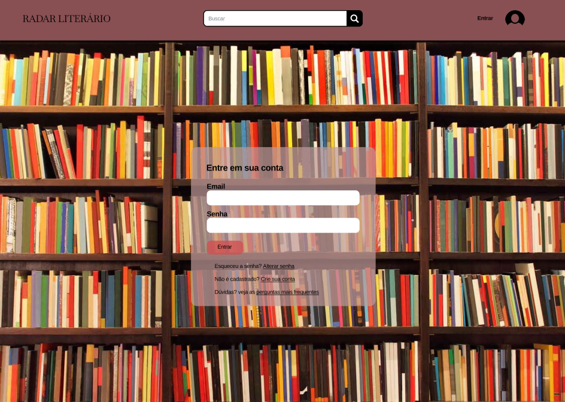

Na tela o usuário pode fazer login no site, preenchendo os campos necessários com as suas credenciais já cadastradas. O usuário também poderá ser direcionado para a [tela de cadastro](#cadastro) ao clicar na opção “Crie sua conta” e para a [tela de alteração da senha](#alteração-de-senha-etapa-1) na opção "Alterar senha", opções presentes abaixo do botão "Entrar" no formulário de Login.

### Cadastro

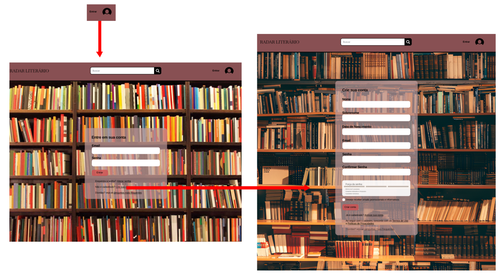

A tela de cadastro permite ao usuário criar uma conta no site caso ainda não seja cadastrado, seguindo um formulário com campos de preenchimento referentes a dados necessários:

* Nome
* Sobrenome
* Data de Nascimento
* Email
* Senha

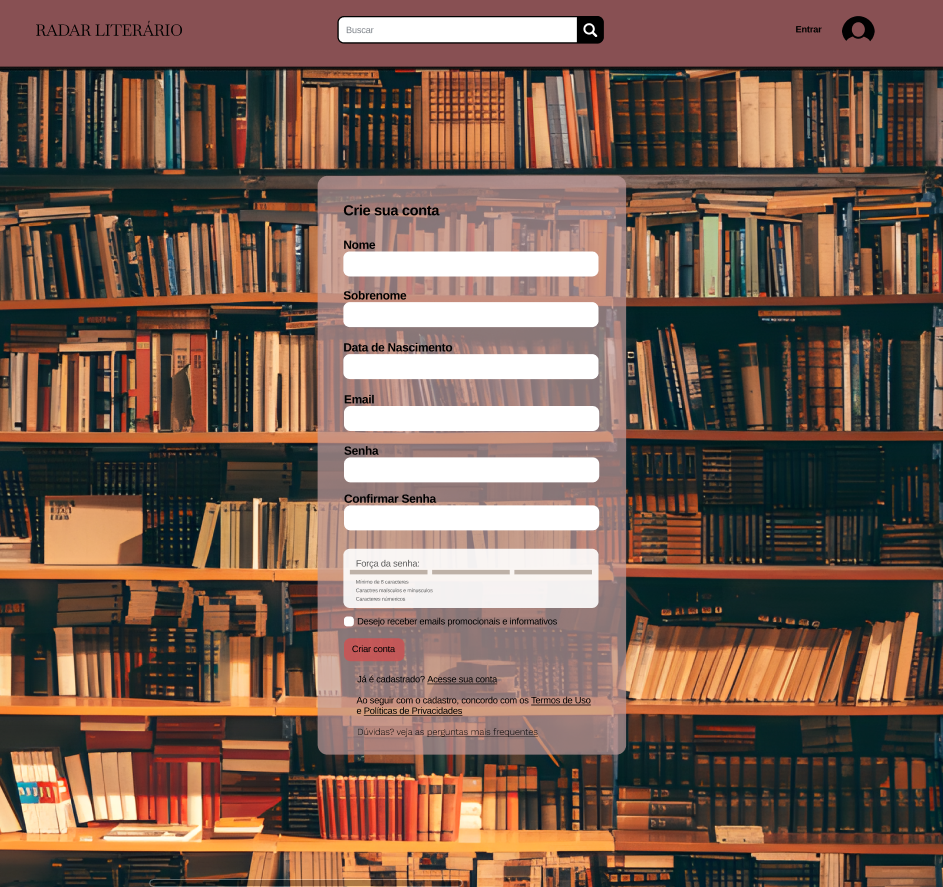

O usuário também poderá ser direcionado para a [tela de Login](#login) ao clicar na opção “Acesse sua conta” ou confirmar o cadastro ao clicar no botão "Criar conta".

### Tela de Busca

Assim que o usuário informa um tópico de pesquisa no campo de busca, ao clicar no ícone de lupa ou teclar _Enter_, ele é encaminhado para uma tela com os resultados de busca com filtros, no qual ele pode melhorar os resultados quanto à categoria, conforme a imagem abaixo.

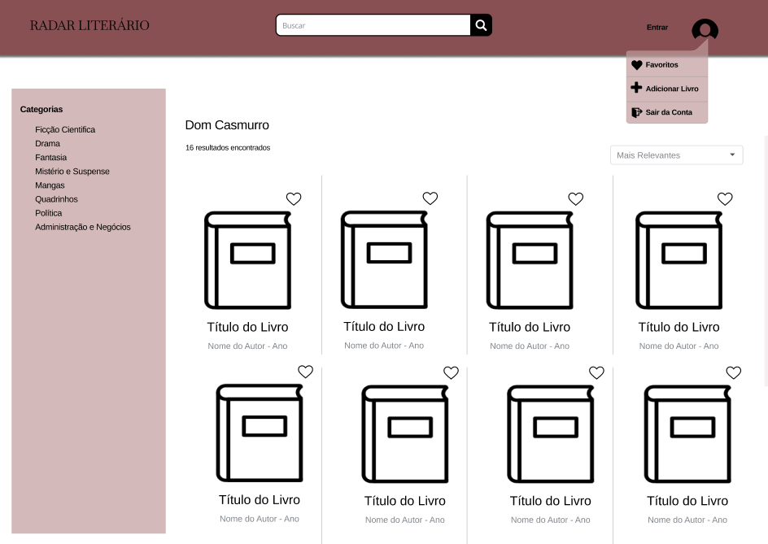

Ao clicar no livro do resultado, o usuário é levado para a [tela de visualização do livro](#visualização-do-livro) com mais informações. Além disso, caso o usuário esteja logado, ele poderá manter o mouse sobre o seu nome no canto superior direito para ver um submenu com mais opções ([Favoritos](#favoritos), [Adicionar Livros](#upload-de-livros) ou Sair) ou clicar em seu nome para abrir a [tela com as informações da conta](#minha-conta).

### Visualização do Livro

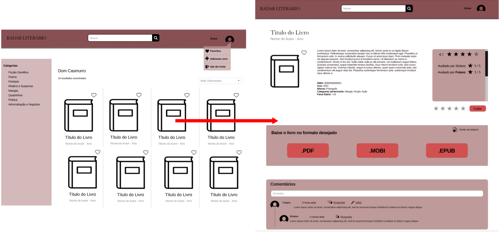

Ao selecionar uma das opções resultantes da pesquisa, é possível visualizar detalhes do livro, como capa, título, autor, sinopse, categorias, ISBN, faixa etária, idioma e ano de publicação. O usuário também tem acesso a um espaço para avaliar o livro no canto direito, fazer o download do arquivo para leitura escolhendo o melhor formato ou comentar sobre o livro acessado no canto inferior.

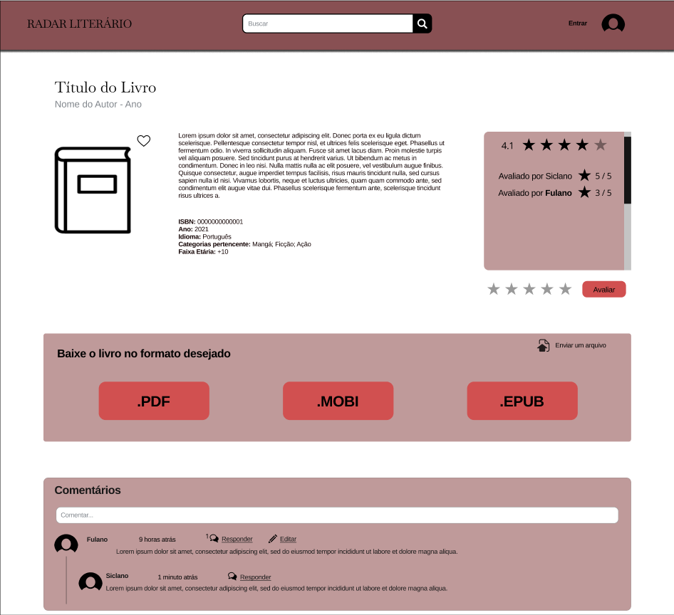

Além disso, caso o usuário queira complementar ou corrigir algumas informações ou enviar um arquivo melhor ou que esteja faltando, ele poderá clicar em "Enviar um arquivo" para acessar a [página de upload e cadastro do livro](#upload-de-livros), opção presente no mesmo espaço das opções para download.

### Upload de Livros

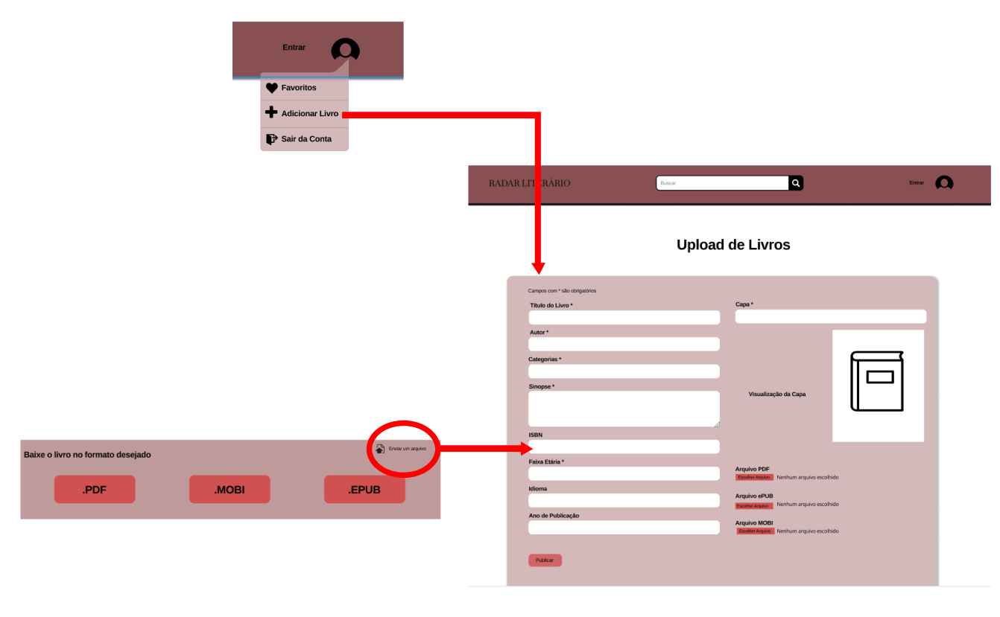

A tela de upload de livros é o espaço dedicada para o usuário cadastrar as informações de um livro que ainda não esteja cadastrado no site ou atualizar os dados. Nela existe campos de preenchimento obrigatórios e opcionais, são eles:

Obrigatórios:
* Titulo do Livro
* Autor
* Capa
* Categorias
* Sinopse
* Faixa Etária

Opcionais:
* ISBN
* Idioma
* Ano de Publicação

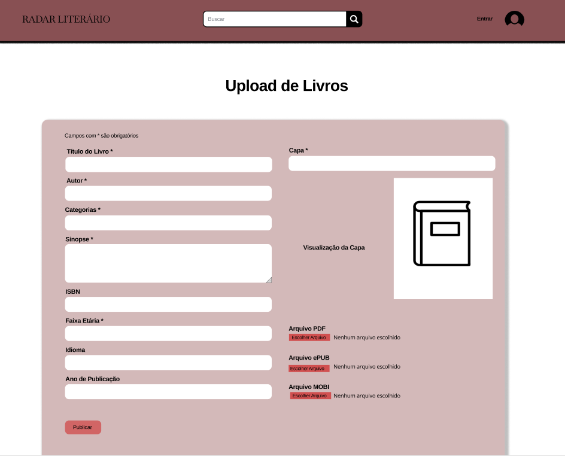

Além disso, existe três áreas para upload de arquivos de texto comuns para livros digitais (PDF, ePUB e MOBI). Onde o usuário é obrigado a realizar o upload de, pelo menos, um durante o primeiro cadastro do livro. A página pode ser acessada em todas as telas de navegação ao manter o mouse sobre o nome do perfil no canto superior direito das telas e clicar em "Adicionar Livro", como mostrado na [tela de busca](#tela-de-busca).

### Favoritos

A tela de favoritos retratada abaixo permite ao usuário visualizar todos os livros que foram favoritados por ele ao clicar no ícone de coração junto da capa do livro. 

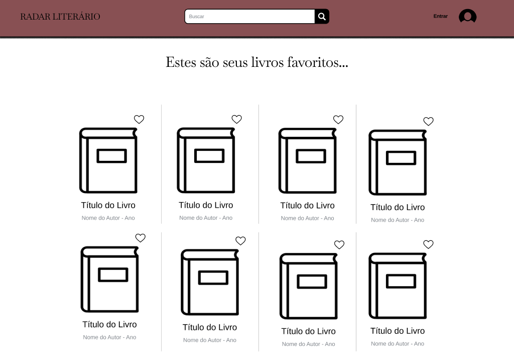

A página pode ser acessada em todas as telas de navegação ao manter o mouse sobre o nome do perfil no canto superior direito das telas e clicar em "Favoritos", como mostrado na [tela de busca](#tela-de-busca). Ao clicar no coração em livro que já foi favoritado, ele será removido dos favoritos e ao clicar no livro será direcionando para a [tela de visualização de livros](#visualização-do-livro).

### Minha Conta

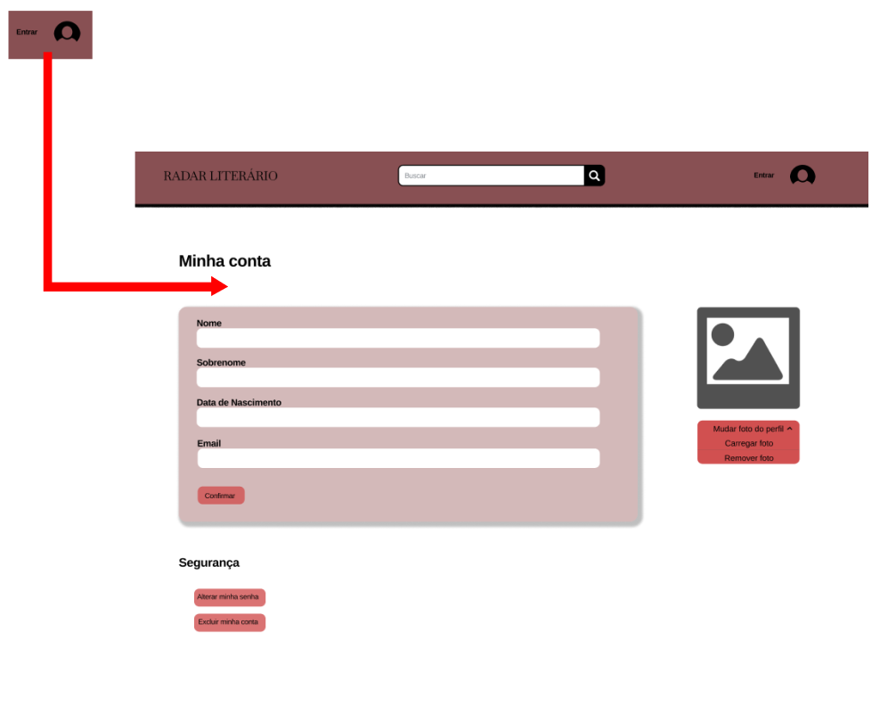

A tela apresenta os dados pessoais de cadastro do usuário e que podem ser editados ao alterar a informação do campo desejado e clicar no botão "Confirmar". Além disso, a tela tem opções para "[Alterar minha senha](#alteração-de-senha-etapa-1)", "Excluir minha conta" e uma área no canto direito para adicionar, alterar ou remover uma foto de perfil.

A página pode ser acessada em todas as telas ao clicar sobre o nome do perfil no canto superior direito das telas.

### Alteração de Senha (Etapa 1)

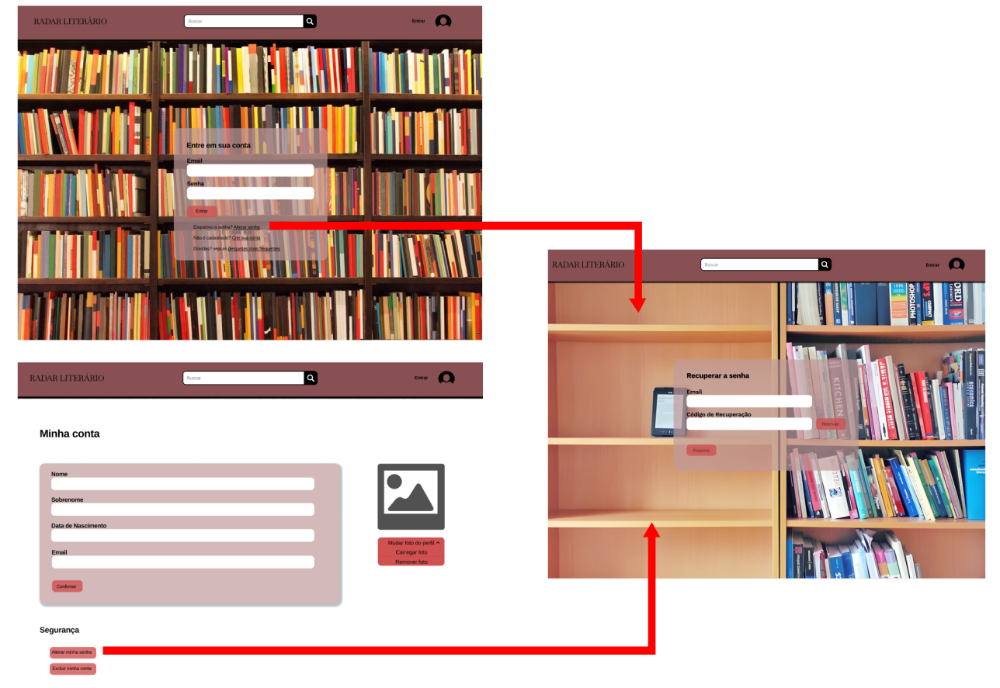

A alteração de senha é feita em 2 etapas/telas diferentes. A primeira apresenta um formulário para o usuário inserir o seu email para receber um código de verificação, este email precisa já estar em uso por alguma conta cadastrada no site.

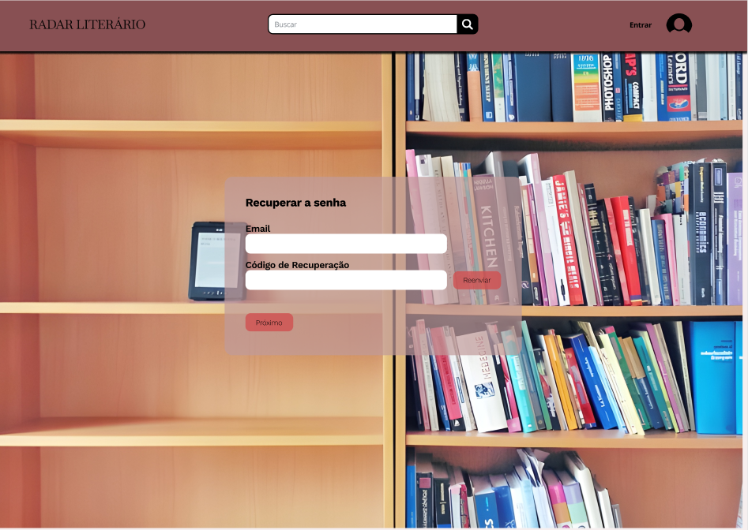

Depois de confirmar o código de verificação recebido pelo email e clicar no botão "Próximo", o usuário é direcionado para a [segunda tela](#alteração-de-senha-etapa-2) onde poderá criar a nova senha. Caso o usuário não tenha recebido o código, ele poderá pedir o reenvio ao clicar no botão "Reenviar" ao lado do campo de inserção do código de verificação.

### Alteração de Senha (Etapa 2)

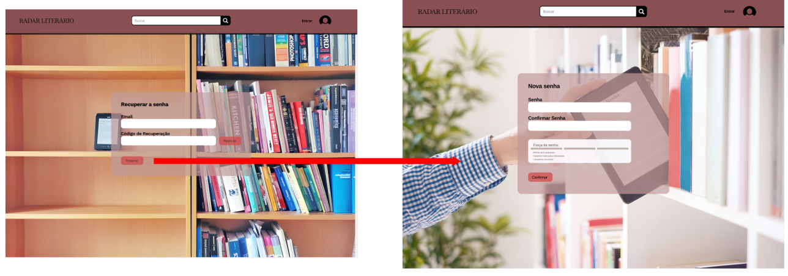

Nesta tela o usuário poderá redefinir a sua senha, digitando a nova senha no primeiro campo e digitando mais uma vez no segundo campo para confirmar a senha que pretende criar e evitar erros de digitação.

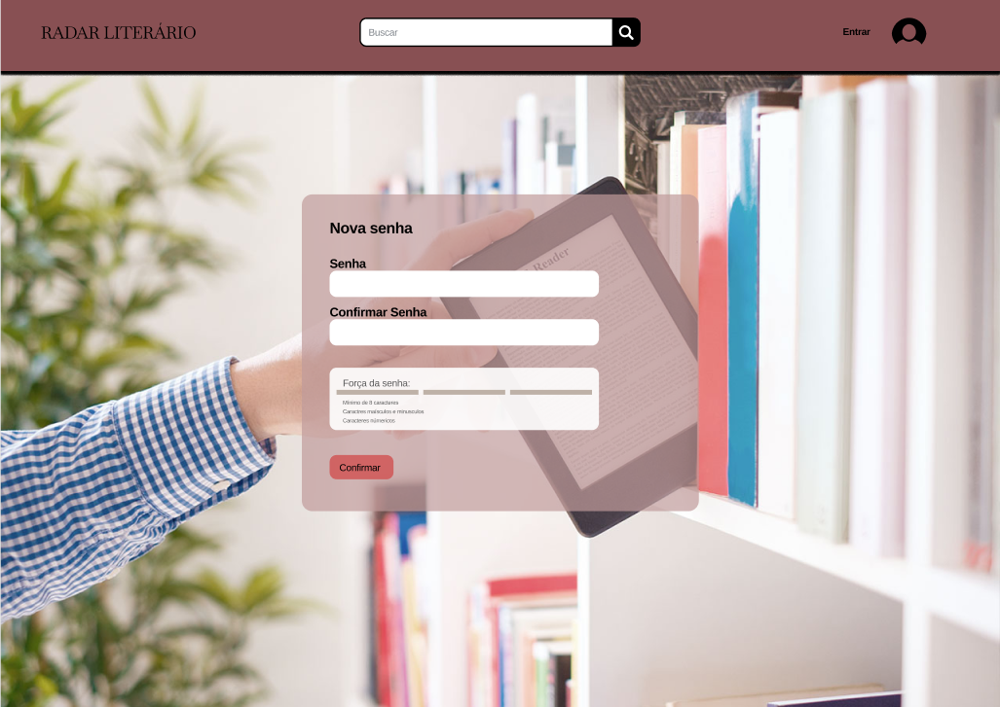

O usuário também poderá verificar a eficiência da sua senha para a segurança da conta em um espaço logo abaixo dos campos de digitação e clicar no botão "Confirmar" caso queira concluir a alteração. Depois de alterar a sua senha, o usuário será direcionado de volta para a [tela de Login](#login).
