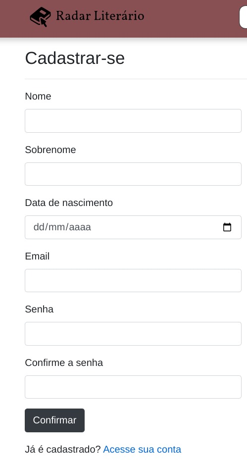
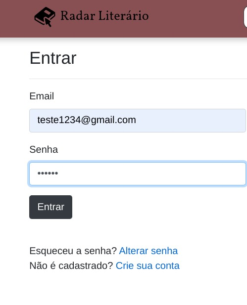
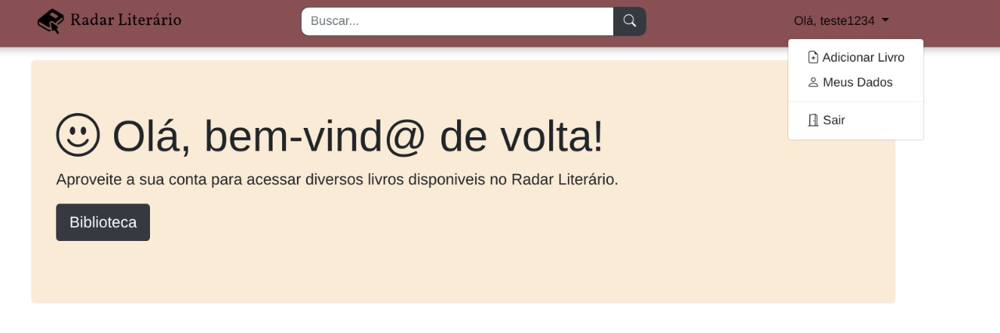
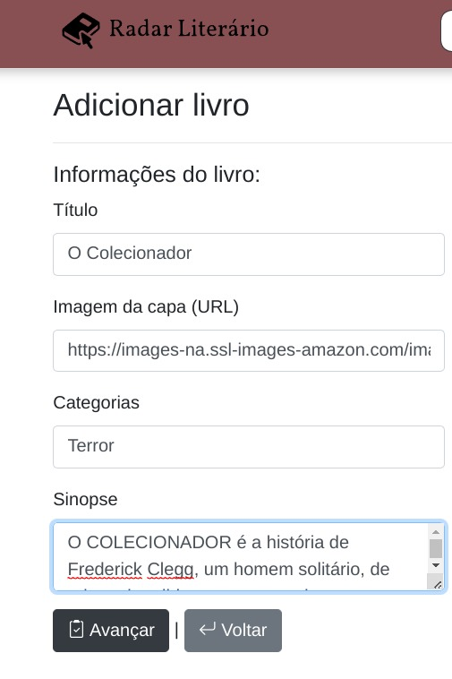
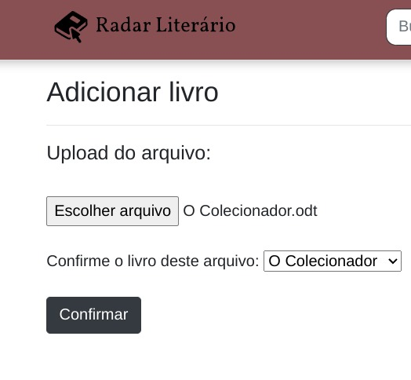
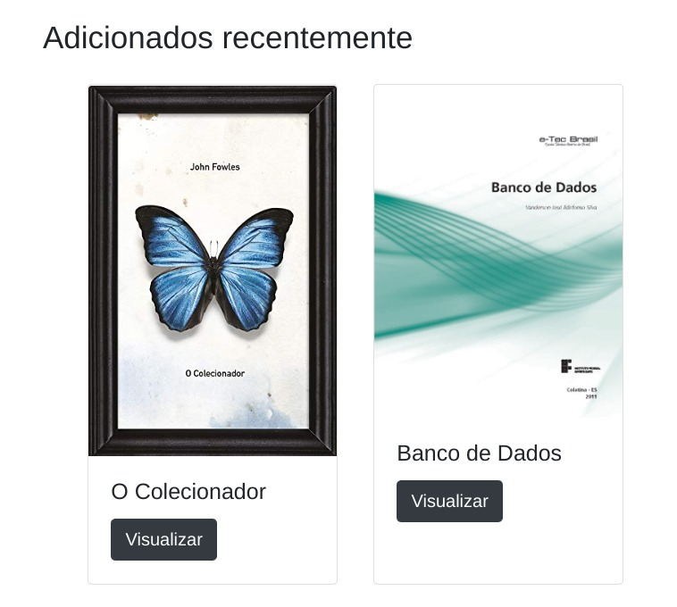
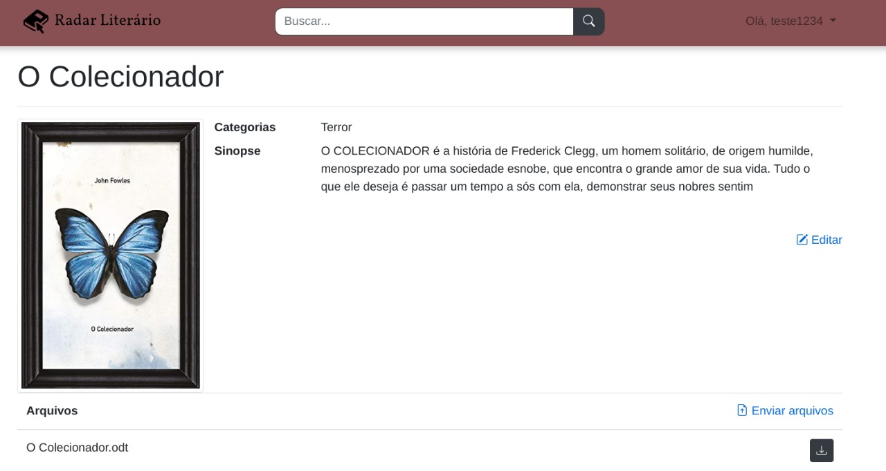
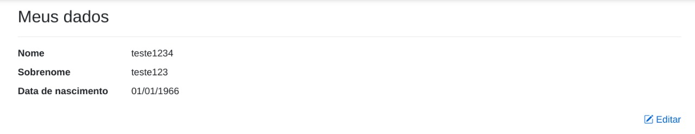
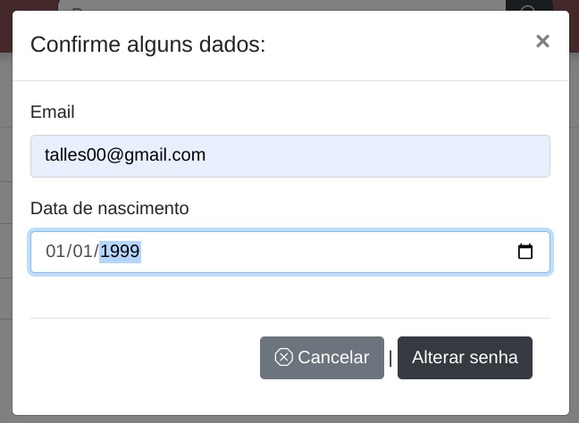
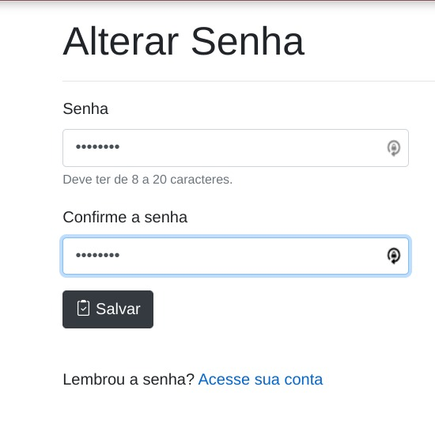

# Registro de Testes de Software

## CT-01 - Cadastrar usuário

Após preencher todos os dados necessários para realizar o cadastro foi possível salvar todas as informações no banco de dados.

## CT-02 - Se conectar com os dados de acesso cadastrado

Após realizar o cadastro do usuario, foi possível logar na aplicação varias vezes utilizando as informações salvas no banco de dados.

## CT-03 - Fazer upload de livro

Após clicar em adcionar livro e preencher o formulário de informações do ebook e escolher o arquivo do livro em pdf, foi possível realizar o upload do arquivo e armazenar todas as informações no banco de dados.

## CT-04 - Visualizar as informações do livro escolhido

Após clicar em qualquer livro disponivel na biblioteca da aplicação foi possível visualizar informações do ebook como capa, título, sinopse e gênero.

## CT-05 - Fazer download de livro

Após clicar em qualquer livro disponível na biblioteca da aplicação foi possível baixar o ebook clicando no botão de download. 

## CT-06 - Pesquisar um livro

Através da barra de pesquisa na aplicação foi possível encotrar o livro desejado.

## CT-07 - Visualizar e editar dados do usuário

Após o usuario realizar o cadastro na aplicação foi possível visualizar e editar seus dados pessoais.

## CT-08 - Recuperar senha

O usuario consegue logar na aplicação utilizando a nova senha, após preencher o formulário de recuperação de senha.