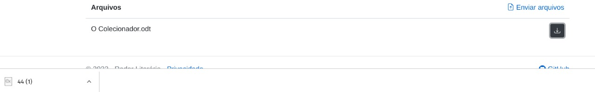

# Registro de Testes de Software

## CT-01 - Cadastrar usuário

## CT-02 - Se conectar com os dados de acesso cadastrado

## CT-03 - Fazer upload de livro

## CT-04 - Visualizar as informações do livro escolhido

## CT-05 - Fazer download de livro

## CT-06 - Pesquisar um livro

## CT-07 - Visualizar e editar dados do usuário

## CT-08 - Avaliar e comentar os livros disponíveis
Sera implementado na proxima etapa!